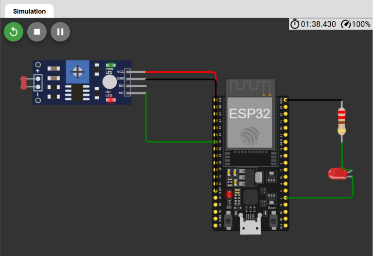
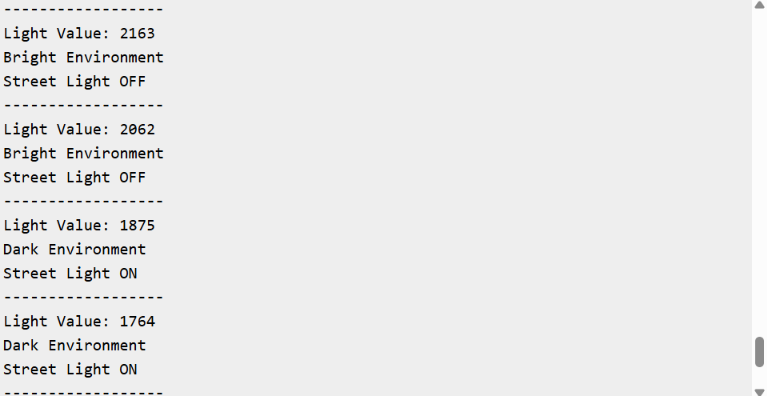

# Smart Street Light System

## Overview

An ESP32-based smart street lighting system developed using the Wokwi simulation platform. The system automatically controls street lights based on ambient light intensity detected by an LDR sensor.

## Features

* Automatic street light control
* Ambient light sensing using LDR
* Threshold-based automation
* ESP32 and sensor interfacing
* Simulation and testing using Wokwi

## Components Used

* ESP32 Development Board
* LDR Sensor Module
* LED
* 220Ω Resistor

## Technologies Used

* Embedded C++
* Arduino Framework
* ESP32
* Wokwi Simulator

## Circuit Diagram

## Output

## Working

The ESP32 continuously reads light intensity values from the LDR sensor using ADC (Analog-to-Digital Conversion). When the light intensity falls below a predefined threshold, the street light turns ON automatically. When sufficient ambient light is available, the street light turns OFF, ensuring efficient energy utilization.

## Applications

* Smart Cities
* Automatic Street Lighting
* Energy Saving Systems
* Industrial and Campus Lighting

## Author

Dheeraj Kumar
B.Tech, Electronics and Communication Engineering
IIIT Bhagalpur
